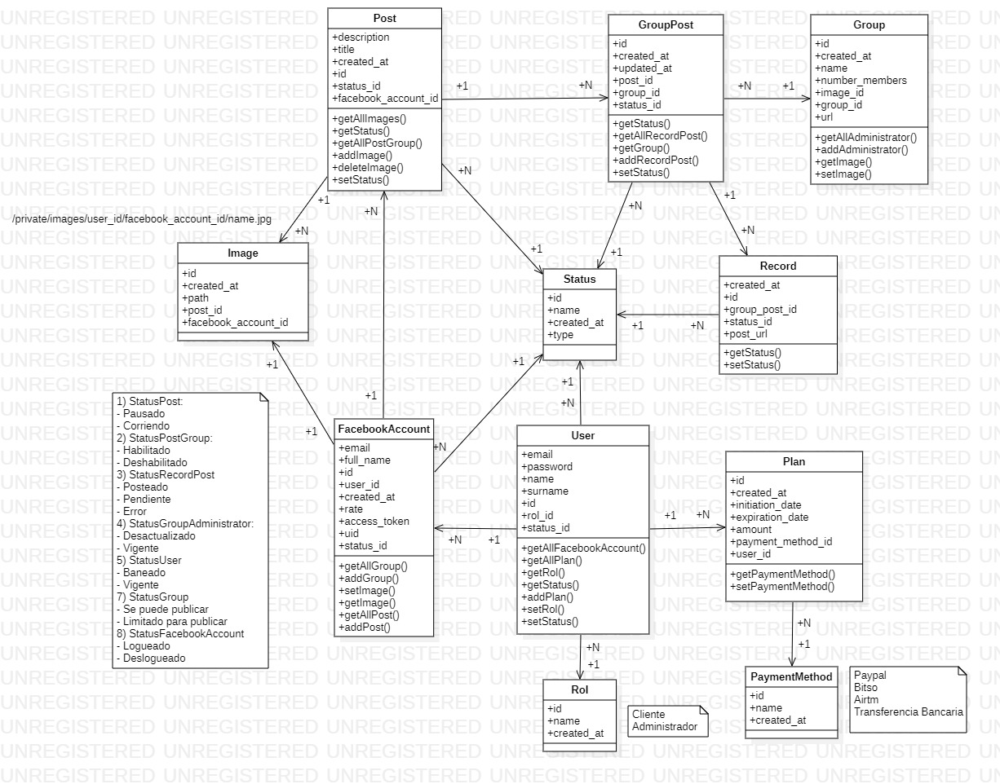

# Gestor de cuentas de Facebook en Laravel
Permite gestionar las cuentas de facebook para programar publicaciones de forma automática en grupos específicos de Facebook. Requiere la utilización de esta API <a href="https://github.com/octavio1243/Facebook-API-Python">Click aquí</a>

## Diagrama de clases

